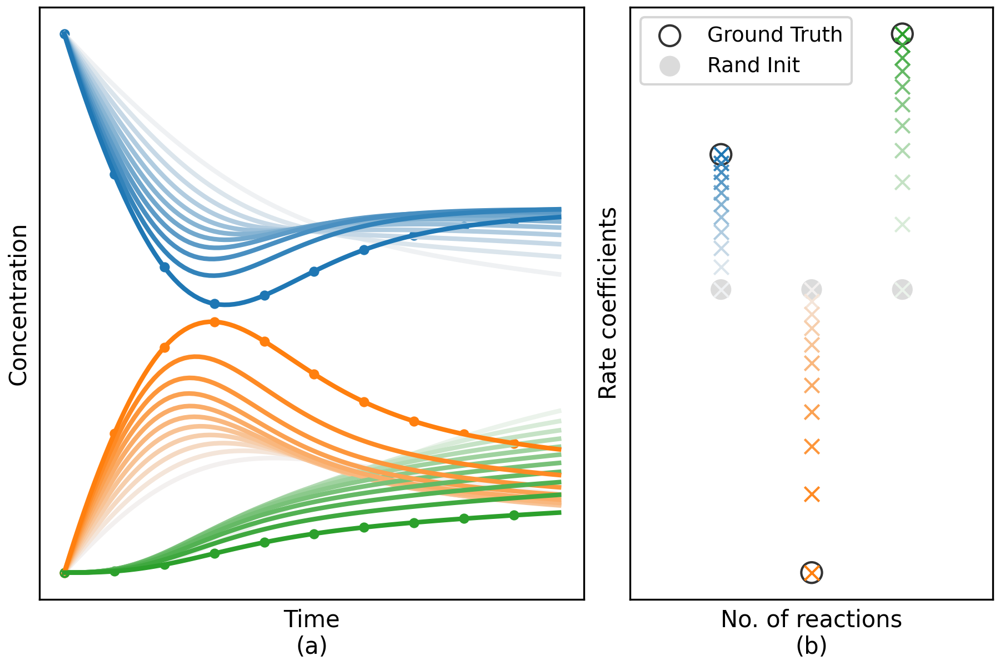

# SPIN-ODE: **S**tiff **P**hysics-**I**nformed **N**eural **ODE** for Chemical Reaction Rate Estimation
Code for paper: [SPIN-ODE](https://doi.org/10.48550/arXiv.2505.05625)

SPIN-ODE fits concentration trajectories (a) to infer reaction rate coefficients (b), converging from random initialization to
the true data (light colour → dark colour).

<p align="center">
    
</p>

## Environment
The code was developed in a `jax` python env in a `module` system, packages included is listed [here](https://a3s.fi/python-pkg-lists/jax.txt)

Additional package is `diffrax`.

## Data
We use 3 dataset:
- Robertson: The classic Robertson stiff ODE system.
- POLLU: The air pollution stiff ODE system.
- AOXID: Toy autoxidation chemistry system.

Robertson and POLLU dataset are simulated by the Scipy BDF stiff ODE solver. AOXID are simulated by Kinetic PreProcessor (KPP), we also provides 10 AOXID trajectory data with different initial concentrations in [`results_t100_dt1_10/`](results_t100_dt1_10/). One example input file for KPP is [`toy_44.def`](toy_44.def). All data generation/loading has been integrated in the training script already.

## Run
There are two training scripts:
- [`nnrr-jax.py`](nnrr-jax.py): neural ODE training, where the network is followed by ODE solver to train on concentration.
- [`nnrr-jax-coll.py`](nnrr-jax-coll.py): pre-training, where network is trained on collocation dataset.

All features/hyper-parameters are controlled by `yaml` config files. Examples are provided in [`config/`](config) folder. Each script is for one experiment setup, in which there are `yaml` target for different dataset and training steps.

Additionally, a few command line parameters are used to choose script and target, as well as switch for logging. See `python nnrr-jax.py --help` for details.

**All the commands we use** are provided in the [`slurm.sh`](slurm.sh), itself is also useful to run SPIN-ODE on HPC with SLURM scheduling system.

For example, the full 3-step approach described in our paper on the Robertson dataset:
```shell
# step 1: train MLP to fit nODE traj
python nnrr-jax.py --config configs/spin.yaml --target rober_fit

# step 2: train CRNN with deriv from interpolated traj inferenced by MLP
python nnrr-jax-coll.py --config configs/spin.yaml --target rober_coll

# step : fine-tune on CRNN with estimated rate coefficient
python nnrr-jax.py --config configs/spin.yaml --target rober_tune
```

## Acknowledgement
- [Diffrax](https://docs.kidger.site/diffrax/citation/)
- [CRNN](https://github.com/DENG-MIT/CRNN)
- [Stiff Neural ODE](https://github.com/DENG-MIT/StiffNeuralODE)
- [Collocation training for stiff neural ODE](https://github.com/Xiangjun-Huang/training_stiff_NODE_in_WW_modelling)
