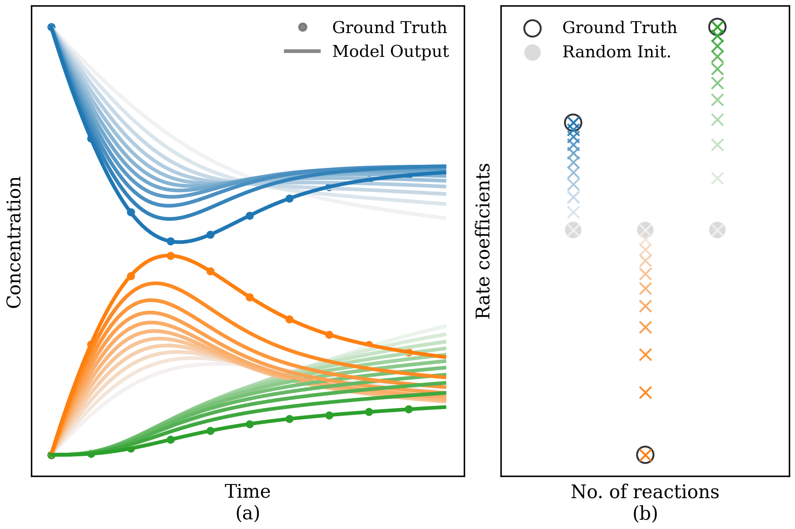

# SPIN-ODE

SPIN-ODE fits concentration trajectories (a) to infer reaction rate coefficients (b), converging from random initialization to
the true data (light colour → dark colour).

<p align="center">
    
</p>

SPIN-ODE is a 3-step approach to retrive reaction rate coefficient. 
1. A Neural ODE model fits the ODE trajectory
2. We generate a set of (y, dydt) data using the trained Neural ODE model, and optimise rate coefficients in the process-based kinetic model against (y, dydt), no ODE solve is involved in this step.
3. We inference the ODE trajectory with the pre-trained process-based kinetic model and a ODE solver, and further optimise the rate coefficient against (y0, y1)

Whether first 2 steps are needed depends on how uncertainty the rate coefficients are prior known. If the uncertainty is moderate, for example around 50% in log scale for the POLLU scheme, the 3rd step solely is enough. However, larger uncertainty would make the ODE solve and optimisation instable, and in that case first 2 steps are necessary.


## Data
We use 2 dataset, both generated using the diffrax Kvaerno5 ODE solver:
- pollu: The simplified air pollution stiff ODE system.
- toy: Toy VOC autoxidation chemistry system.

## Run
Features and hyper-parameters are controlled by `yaml` configuration files, 2 config files are provided for each dataset. Different `yaml` targets inside each config are for different training steps.

```sh
# Step 0: check cmd arguments
python spin_ode/xxx.py --help

# Step 1: train Neural ODE to fit ODE traj
python spin_ode/traj_fit.py -c spin_ode/toy.yaml -t traj_fit -s experiments/traj_fit

# Step 2: generate (y, dydt) from Neural ODE and optimisate the rate coefficients in the process-based kinetic model
python spin_ode/est_rate_dydt.py -c spin_ode/toy.yaml -t est_rate_neural_ode -s experiments/est_rate_nn/
# Alternatively, generate (y, dydt) using finite difference from the ODE traj
python spin_ode/est_rate_dydt.py -c spin_ode/toy.yaml -t est_rate_finite_diff -s experiments/est_rate_finite_diff/

# Step 3: inference ODE traj using process-based kinetic model and ODE solver, and optimise rate coefficients against predicted traj
python spin_ode/est_rate_traj.py -c spin_ode/toy.yaml -t est_rate_traj -s experiments/est_rate_traj/
```